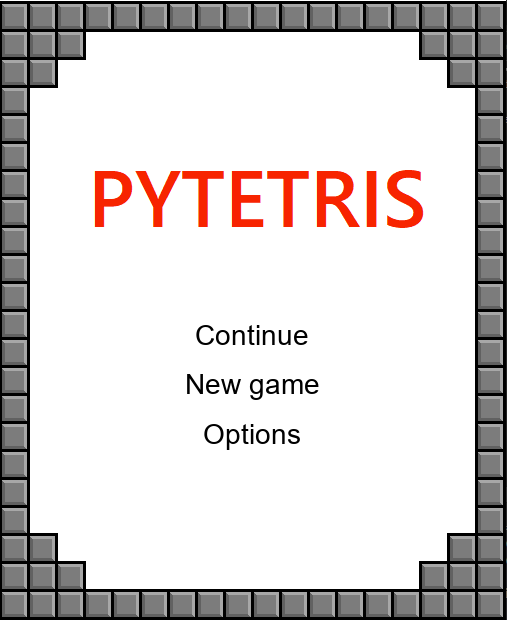
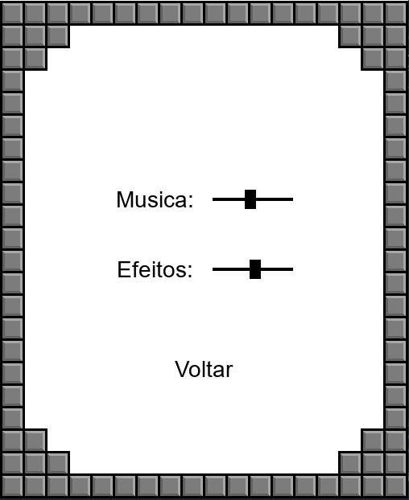
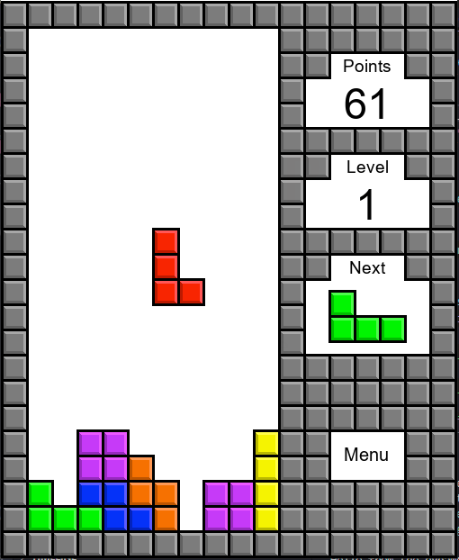

## pytetris
 #Tetris feito utilizando a biblioteca pygame.
 

# Como jogar

* instalar pygame: pip install pygame
* baixar jogo: git clone https://github.com/PauloHFArruda/pytetris
* rodar "pytetris.py"
